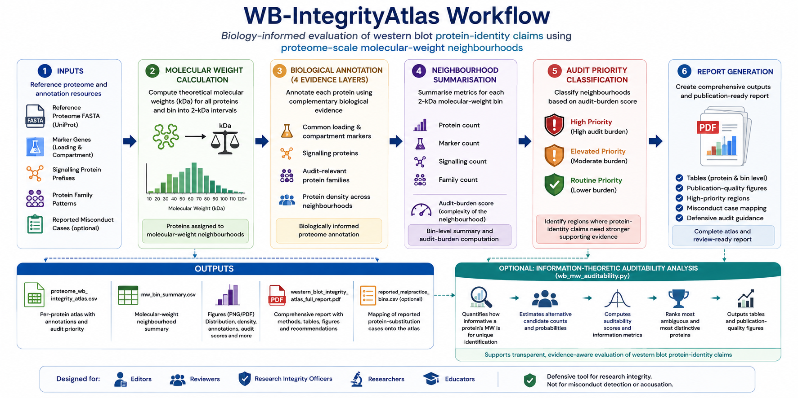

<p align="center">
  
</p>

<h1 align="center">WB-IntegrityAtlas</h1>

<p align="center">
<b>A biology-informed framework for evaluating western blot protein-identity claims using proteome-scale molecular-weight neighbourhoods.</b>
</p>

<p align="center">


</p>

---

## Overview

WB-IntegrityAtlas is a biology-informed computational framework developed to support the evaluation of western blot protein-identity claims.

Unlike conventional image-forensics tools, which detect duplicated or manipulated images, WB-IntegrityAtlas evaluates the **biological context** surrounding a reported protein by characterising the complexity of its molecular-weight neighbourhood within the reference proteome.

The framework integrates

- Protein density
- Common loading and compartment markers
- Frequently studied signalling proteins
- Audit-relevant protein families

to identify molecular-weight regions where protein-identity claims may require stronger supporting biological evidence.

---

## Graphical Overview

<p align="center">

</p>

**WB-IntegrityAtlas workflow.** Starting from a reference proteome, the pipeline calculates theoretical molecular weights, organises proteins into molecular-weight neighbourhoods, annotates proteins using biologically relevant audit features, computes neighbourhood-level statistics, assigns audit-priority categories, and generates publication-ready outputs for biology-informed western blot review. A downstream module (`wb_mw_auditability.py`, described below) then extends this discrete, fixed-bin atlas with a continuous, Gaussian-kernel molecular-weight auditability analysis.

---

## Why WB-IntegrityAtlas?

Western blot integrity assessment has traditionally focused on detecting:

- duplicated panels
- inappropriate image manipulation
- image splicing
- image reuse
- AI-generated scientific images

Although these approaches are extremely valuable, they do not determine whether a western blot band actually represents the reported protein.

Protein identity depends upon biological evidence including

- theoretical molecular weight
- neighbouring proteins with similar migration
- loading controls
- signalling proteins
- protein-family relationships
- antibody specificity
- orthogonal validation

WB-IntegrityAtlas addresses this complementary problem by providing proteome-wide biological context for western blot interpretation.

---

# Key Features

✓ Proteome-wide molecular-weight atlas

✓ Automatic theoretical molecular-weight calculation

✓ Protein-density analysis

✓ Common loading-control annotation

✓ Compartment-marker annotation

✓ Signalling-protein annotation

✓ Audit-relevant protein-family annotation

✓ Molecular-weight neighbourhood construction

✓ Audit-priority scoring

✓ Comprehensive PDF report generation

✓ Continuous, Gaussian-kernel molecular-weight auditability analysis

✓ Query-specific molecular-weight auditability for one or several claimed/observed bands

✓ Legacy 2-kDa bin versus continuous Gaussian comparison

✓ Documented protein-substitution case mapping (Figure 6)

✓ Species-independent design

---

# Workflow

```
Reference proteome FASTA
            │
            ▼
Sequence parsing
            │
            ▼
Theoretical molecular-weight calculation
            │
            ▼
Protein assignment into 2-kDa neighbourhoods
            │
            ▼
Biological annotation

    • Protein density
    • Common markers
    • Signalling proteins
    • Protein families

            │
            ▼
Neighbourhood summarisation
            │
            ▼
Audit-burden scoring
            │
            ▼
Audit-priority classification
            │
            ▼
Generated outputs

• Protein atlas
• Bin summary
• Figures
• PDF report
            │
            ▼
Downstream: continuous Gaussian-kernel
molecular-weight auditability analysis
(wb_mw_auditability.py)
```

---

# Repository Structure

```
WB-IntegrityAtlas/

configs/
    Species-specific annotation files

malpractice/
    Publicly documented protein-substitution cases

demo_full_output/
    Example output generated from demo FASTA

reference_full_output/
    Reference atlas output

wb_integrity_atlas_full_report.py
    Main atlas-generation pipeline

wb_integrity_atlas_externalized.py
    Legacy implementation

wb_mw_auditability.py
    Continuous molecular-weight auditability analysis (downstream module)

requirements.txt

README.md
```

---

# Installation

Clone the repository

```bash
git clone https://github.com/USERNAME/WB-IntegrityAtlas.git

cd WB-IntegrityAtlas
```

Install dependencies

```bash
python -m pip install -r requirements.txt
```

or

```bash
pip install pandas matplotlib reportlab numpy
```

Python 3.10 or newer is recommended for `wb_mw_auditability.py`; the rest of the pipeline supports Python 3.9+.

---

# Required Inputs

The main pipeline requires:

### 1. Reference proteome FASTA

Example

```
human_UP000005640.fasta
```

---

### 2. Marker annotation

```
configs/human_marker_genes.tsv
```

Contains

- gene symbols
- marker categories
- notes

---

### 3. Signalling prefixes

```
configs/human_signaling_prefixes.tsv
```

Contains

- signalling prefixes
- pathway annotations

---

### 4. Protein-family annotations

```
configs/human_family_patterns.tsv
```

Contains

- family names
- regular-expression patterns
- biological categories

---

### 5. Malpractice dataset (optional)

```
malpractice/human_reported_malpractice_cases.tsv
```

Used for mapping documented protein-substitution cases onto the atlas.

---

# Running WB-IntegrityAtlas

Example:

```bash
python wb_integrity_atlas_full_report.py \
--proteome-fasta human_UP000005640.fasta \
--marker-file configs/human_marker_genes.tsv \
--signaling-prefix-file configs/human_signaling_prefixes.tsv \
--family-pattern-file configs/human_family_patterns.tsv \
--malpractice-file malpractice/human_reported_malpractice_cases.tsv \
--species-name "Homo sapiens" \
--outdir human_wb_atlas
```

---

# Outputs

Each analysis generates the following outputs.

---

## Protein Atlas

```
proteome_wb_integrity_atlas.csv
```

Contains one row per protein including

- accession
- protein name
- gene symbol
- sequence length
- theoretical molecular weight
- molecular-weight neighbourhood
- marker annotation
- signalling annotation
- protein-family annotation
- audit-burden score
- audit-priority category
- defensive review recommendation

---

## Molecular-Weight Bin Summary

```
mw_bin_summary.csv
```

Contains

- protein count
- marker count
- signalling count
- family count
- representative proteins
- dominant families
- audit-burden score
- audit priority

---

## Figures

High-resolution publication-quality figures including

- Molecular-weight distribution

- Protein-density distribution

- Marker distribution

- Signalling-protein distribution

- Audit-burden distribution

---

## PDF Report

```
western_blot_integrity_atlas_full_report_with_plots.pdf
```

Contains

- summary statistics

- methods

- publication-quality figures

- molecular-weight neighbourhood tables

- highest-priority regions

- integrity recommendations

---

# Molecular-Weight Auditability Analysis (`wb_mw_auditability.py`)

## Purpose

`wb_mw_auditability.py` is a downstream analysis module for the Western Blot Integrity Atlas.

Run it **after** `wb_integrity_atlas_full_report.py`. The upstream full-report pipeline creates the annotated per-protein atlas and molecular-weight bin summary. This script then replaces fixed-bin-only density interpretation with continuous molecular-weight compatibility calculations while preserving and extending the marker, signalling, protein-family, and documented-case annotations already generated upstream.

> **The module is intended for defensive research-integrity auditing.** Molecular-weight similarity, annotation density, or a high contextual audit-burden score is **not** evidence of fabrication, substitution, or protein identity. These metrics indicate where molecular weight alone is less discriminative and where additional validation or provenance is especially useful.

## Required upstream files

The atlas directory should normally contain:

```text
proteome_wb_integrity_atlas.csv
mw_bin_summary.csv
reported_malpractice_bins.csv       # optional
western_blot_integrity_atlas_report.pdf
...
```

The required input is:

```text
proteome_wb_integrity_atlas.csv
```

The script automatically reuses annotation columns written by the upstream full-report pipeline, including, when available:

```text
gene_primary
accession
protein_name
mw_kda
is_marker
marker_categories
is_signaling_prefix
signaling_categories
families
mw_bin_label
audit_priority
defensive_note
```

`mw_bin_summary.csv` is optional but recommended because it enables direct legacy 2-kDa versus Gaussian comparison outputs.

No marker, signalling-prefix, or family-pattern TSV needs to be supplied again if `proteome_wb_integrity_atlas.csv` was generated correctly by `wb_integrity_atlas_full_report.py`.

## Installation

Python 3.10 or newer is recommended.

```bash
pip install numpy pandas matplotlib
```

## Basic use

```bash
python wb_mw_auditability.py /path/to/wb_integrity_atlas_out
```

## Query one claimed or observed band

```bash
python wb_mw_auditability.py \
    /path/to/human_wb_atlas \
    --query-mw 42.0
```

## Query several claimed or observed bands

```bash
python wb_mw_auditability.py \
    /path/to/human_wb_atlas \
    --query-mw 42.0,45.7,55.0,100.3
```

## Recommended analysis command

```bash
python wb_mw_auditability.py \
    /path/to/human_wb_atlas \
    --bin-width 2 \
    --tolerance-kda 2 \
    --sigma-kda 1 \
    --kernel-cutoff-sigma 4 \
    --grid-step 0.25 \
    --context-weights 1,1,1,1 \
    --family-min-members 2 \
    --top-family-plots 12 \
    --case-mapping auto
```

## Core molecular-weight model

For an observed or evaluated molecular weight $q$, and theoretical molecular weight $M_j$ of proteome entry $j$, Gaussian compatibility is

$$
K_j(q) = \exp\left[-\frac{(M_j - q)^2}{2\sigma^2}\right].
$$

The Gaussian candidate mass is

$$
A(q) = \sum_j K_j(q).
$$

The normalized molecular-weight compatibility distribution is

$$
p_j(q) = \frac{K_j(q)}{\sum_k K_k(q)}.
$$

Identity entropy is

$$
H(q) = -\sum_j p_j(q)\ln p_j(q).
$$

The effective candidate number is

$$
N_{\mathrm{eff}}(q) = \exp\left[H(q)\right].
$$

MW discriminability is

$$
D_{\mathrm{MW}}(q) = \frac{1}{N_{\mathrm{eff}}(q)}.
$$

A hard-window count is retained as a complementary, easy-to-interpret quantity:

$$
N_{\delta}(q) = \sum_j \mathbf{1}\left(|M_j - q| \leq \delta\right).
$$

## Gaussian annotation context

The script does **not** insert markers, signalling annotations, or protein families into the entropy calculation. Entropy remains an identity-ambiguity measure based solely on molecular-weight compatibility.

Instead, annotations are projected onto the same continuous molecular-weight axis using the same Gaussian kernel.

For marker indicator $I_j^{(M)}$:

$$
G_M(q) = \sum_j K_j(q)\, I_j^{(M)}.
$$

For signalling indicator $I_j^{(S)}$:

$$
G_S(q) = \sum_j K_j(q)\, I_j^{(S)}.
$$

For configured family-membership count $F_j$:

$$
G_F(q) = \sum_j K_j(q)\, F_j.
$$

This avoids artificial discontinuities at arbitrary 2-kDa bin edges and preserves the interpretation of each annotation layer.

## Contextual audit-burden index

The script converts molecular-weight ambiguity and each annotation-context signal to an empirical percentile. Let

```text
Q_A(q) = ambiguity percentile
Q_M(q) = marker-context percentile
Q_S(q) = signaling-context percentile
Q_F(q) = family-context percentile
```

The contextual audit-burden index is

$$
B_{\mathrm{ctx}}(q) = w_A Q_A(q) + w_M Q_M(q) + w_S Q_S(q) + w_F Q_F(q),
$$

where

$$
w_A + w_M + w_S + w_F = 1.
$$

The default CLI setting is:

```text
--context-weights 1,1,1,1
```

which is normalized internally to:

```text
0.25, 0.25, 0.25, 0.25
```

The corresponding contextual auditability index is

$$
A_{\mathrm{ctx}}(q) = 1 - B_{\mathrm{ctx}}(q).
$$

The 0 to 100 scores are simple rescalings of these indices.

The weights are configurable. For example:

```bash
--context-weights 2,1,1,1
```

places twice as much relative weight on MW ambiguity as on each annotation layer.

## Why annotations are handled separately from entropy

Marker, signalling, and family labels are biological or audit-context annotations. They do not constitute independent evidence that a candidate protein generated a band.

Putting them directly into $p_j(q)$ would silently convert annotation status into a prior probability of protein identity. That would require a biological model and empirical calibration that the atlas does not currently provide.

The implemented approach therefore keeps two layers separate:

```text
MW identity ambiguity
    Gaussian compatibility
    normalized candidate distribution
    entropy
    effective candidate number

Audit context
    marker Gaussian mass
    signaling Gaussian mass
    family Gaussian mass
    percentile normalization

Combined reporting layer
    contextual audit-burden index
```

## Main outputs

All previous molecular-weight auditability outputs are retained.

```text
mw_auditability_analysis/
├── analysis_parameters.txt
├── TSV/
│   ├── protein_mw_auditability.tsv
│   ├── mw_bin_auditability.tsv
│   ├── mw_grid_information.tsv
│   ├── mw_auditability_summary.tsv
│   ├── top_ambiguous_proteins.tsv
│   ├── top_distinctive_proteins.tsv
│   ├── family_gaussian_profiles.tsv
│   └── legacy_2kda_vs_gaussian_context.tsv
├── Figures/
│   ├── Figure_MW_distribution.*
│   ├── Figure_MW_density_and_effective_candidates.*
│   ├── Figure_protein_auditability_scatter.*
│   ├── Figure_ambiguity_distribution.*
│   ├── Figure_bin_rankings.*
│   ├── Figure_auditability_landscape.*
│   ├── Figure_nearest_neighbor_gap.*
│   ├── Figure_summary_multipanel.*
│   ├── Figure_annotation_context_gaussian.*
│   ├── Figure_contextual_audit_burden.*
│   ├── Figure_ambiguity_vs_contextual_burden.*
│   ├── Figure_family_context_heatmap.*
│   ├── Figure_legacy_2kda_vs_gaussian.*
│   └── Figure_contextual_summary_multipanel.*
├── Query_MW/
└── Case_Mapping/
```

Each figure is written as PNG, PDF, and SVG.

## Query-specific outputs

For:

```bash
--query-mw 42.0,45.7
```

the module creates:

```text
Query_MW/
├── query_mw_summary_all.tsv
├── query_mw_annotation_context_all.tsv
├── 42.0_kDa/
│   ├── query_mw_summary.tsv
│   ├── query_mw_summary_wide.tsv
│   ├── query_mw_candidates.tsv
│   ├── query_mw_local_landscape.tsv
│   ├── query_mw_annotation_context.tsv
│   ├── query_mw_family_context.tsv
│   └── Figures/
└── 45.7_kDa/
    └── ...
```

The candidate table includes all proteome entries and preserves upstream marker, signalling, and family annotations. It adds:

```text
mw_difference_kda
absolute_mw_difference_kda
within_hard_window
gaussian_weight
normalized_compatibility
compatibility_rank
```

## Family context output

`family_gaussian_profiles.tsv` contains a continuous Gaussian profile for each configured family with at least `--family-min-members` matching proteins.

Default:

```bash
--family-min-members 2
```

The number of family traces shown in the heatmap is controlled by:

```bash
--top-family-plots 12
```

## Legacy 2-kDa versus Gaussian comparison

If `mw_bin_summary.csv` exists, the script reads it and evaluates the continuous Gaussian model at the center of every legacy bin.

It writes:

```text
legacy_2kda_vs_gaussian_context.tsv
```

and:

```text
Figure_legacy_2kda_vs_gaussian.*
```

This directly documents what changes when hard bin boundaries are replaced by smooth MW neighborhoods.

The legacy panel retains the original 2-kDa-bin concept. The Gaussian panel maps the same representative proteins onto the continuous effective-candidate landscape.

> Case mapping is an audit illustration based on documented examples. It must not be interpreted as implying that proteins of similar molecular weight are interchangeable.

## Important CLI options

| Option | Default | Meaning |
|---|---:|---|
| `--bin-width` | 2.0 | Descriptive MW bin width |
| `--tolerance-kda` | 2.0 | Hard-window half-width |
| `--sigma-kda` | 1.0 | Gaussian MW compatibility scale |
| `--kernel-cutoff-sigma` | 4.0 | Computational Gaussian cutoff |
| `--grid-step` | 0.25 | Continuous MW grid spacing |
| `--context-weights` | `1,1,1,1` | Ambiguity, marker, signaling, family weights |
| `--family-min-members` | 2 | Minimum family membership for profiles |
| `--top-family-plots` | 12 | Families shown in heatmap |
| `--query-mw` | none | One or comma-separated query MW values |
| `--case-mapping` | auto | Case-mapping behavior |
| `--dpi` | 400 | PNG resolution |

## Recommended sensitivity analysis

For a manuscript, rerun at several Gaussian scales:

```text
sigma = 0.5, 1, 2, 3, and 5 kDa
```

and compare the rank ordering of MW neighborhoods.

The default $\sigma = 1\ \text{kDa}$ should be treated as an analysis parameter, not as a universal physical resolution of every western-blot experiment.

## Interpretation rules

High `mw_effective_candidate_number` means high MW-based identity ambiguity.

High `mw_discriminability` means greater MW-based identity specificity.

High `marker_gaussian_mass`, `signaling_gaussian_mass`, or `family_membership_gaussian_mass` means the MW neighborhood is enriched for the corresponding configured annotation context.

High `contextual_audit_burden_index` means the region combines MW ambiguity with audit-relevant annotation context.

**None of these values is a misconduct probability.**

## Reproducibility

The analysis writes active parameters to:

```text
analysis_parameters.txt
```

For manuscript work, archive that file together with the exact upstream FASTA, annotation TSVs, `proteome_wb_integrity_atlas.csv`, `mw_bin_summary.csv`, and optional malpractice TSV.

---

# Species Support

The framework is fully configurable.

Changing

- reference proteome

- marker annotations

- signalling annotations

- family annotations

allows straightforward adaptation to additional organisms without modifying the underlying workflow. This has been directly validated across six reference proteomes (human, chicken, cow, Drosophila melanogaster, mouse, and yeast) spanning vertebrate, invertebrate, and fungal lineages, for both the discrete 2-kDa neighbourhood analysis and the continuous Gaussian-kernel auditability analysis described above.

---

# Intended Applications

WB-IntegrityAtlas may assist

- journal editors

- peer reviewers

- research-integrity investigators

- laboratory researchers

- educators

during

- western blot review

- manuscript assessment

- editorial screening

- biological interpretation of protein identity

- research-integrity training

---

# Important Interpretation

WB-IntegrityAtlas is **not** an image-forensics tool.

The framework **does not**

- detect image manipulation

- identify scientific misconduct

- determine protein identity

- replace expert scientific judgement

Instead, it identifies molecular-weight neighbourhoods where additional supporting evidence may reasonably be requested.

A high audit-priority score, high `mw_effective_candidate_number`, or high `contextual_audit_burden_index` **does not imply**

- wrongdoing

- incorrect protein identity

- fabricated data

It indicates that the surrounding molecular-weight neighbourhood contains numerous biologically plausible alternative proteins and therefore warrants more careful evaluation.

---

# Citation

If you use WB-IntegrityAtlas in your research, please cite

Dwivedi M., Vijay N.

**Beyond Image Duplication: A Proteome-Scale Framework for Auditing Western Blot Protein-Identity Claims**

(Manuscript submitted.)

---

# License

MIT License

---

# Acknowledgements

The authors thank members of the Computational Evolutionary Genomics Laboratory, IISER Bhopal, for discussions and feedback during the development of WB-IntegrityAtlas.

---

## Disclaimer

WB-IntegrityAtlas is intended exclusively as a defensive research-integrity and educational resource.

It should be used to support transparent, evidence-informed evaluation of western blot protein-identity claims alongside experimental validation and expert scientific judgement. The framework is not intended to diagnose scientific misconduct or replace established editorial or institutional investigation procedures.
